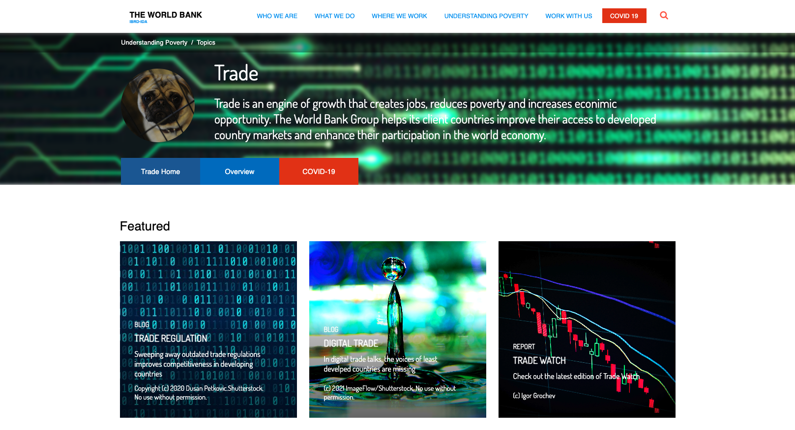
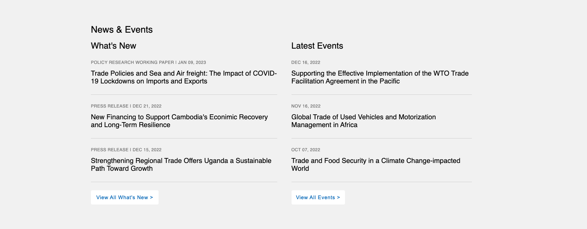
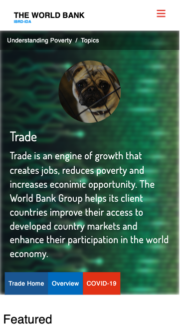
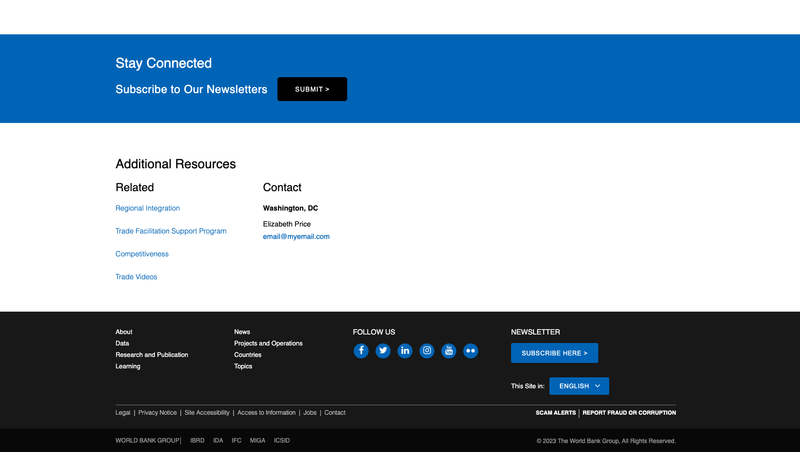

# Clone of World Bank Website Layout

This project is a static clone of the layout of the World Bank's main page. It aims to highlight the similarities in layout and structure with the World Bank's main page as of a specific point in time. Please note that the design of the World Bank website frequently changes, so the accuracy of the design may vary with the current website layout.

## Project Description

### Purpose

The primary purpose of this project is to showcase the developer's web development skills by replicating the layout and structure of the World Bank website's main page using pure HTML and CSS. The project does not aim to copy the actual content, images, or writings of the World Bank website.

### Project Details

- **Clone of Layout:** This project focuses on cloning the layout and structure of the World Bank's main page, including its header, navigation, content sections, and footer.

- **Responsive Design:** The project features a responsive design to ensure an optimal viewing experience on various devices and screen sizes.

- **Static Content:** The project contains static content and images that may differ from the actual World Bank website. The focus is on layout and structure accuracy.

## Technologies Used

This project was built using the following technologies:

- **HTML:** Used to create the structure and layout of the cloned page, including header, navigation, content sections, and footer.

- **CSS:** Employed for styling to replicate the layout and design of the World Bank website as accurately as possible, including making the design responsive.

## Usage

To view the cloned layout of the World Bank's main page:

1. Clone this repository to your local machine.
2. Open the `index.html` file in your web browser.

The cloned layout will showcase the similarities in structure and layout with the World Bank website as of a specific point in time, while also being responsive to various screen sizes.

## Note

Please be aware that this project is intended solely for educational and demonstrative purposes. It does not aim to copy the actual content, images, or writings of the World Bank website. The accuracy of the design may vary with the current website layout of the World Bank.

## License

This project is provided under the MIT License. Refer to the [LICENSE](LICENSE) file for more details.

## Acknowledgments

This project was inspired by the layout and structure of the World Bank website. We acknowledge the World Bank for providing the inspiration for this project.
